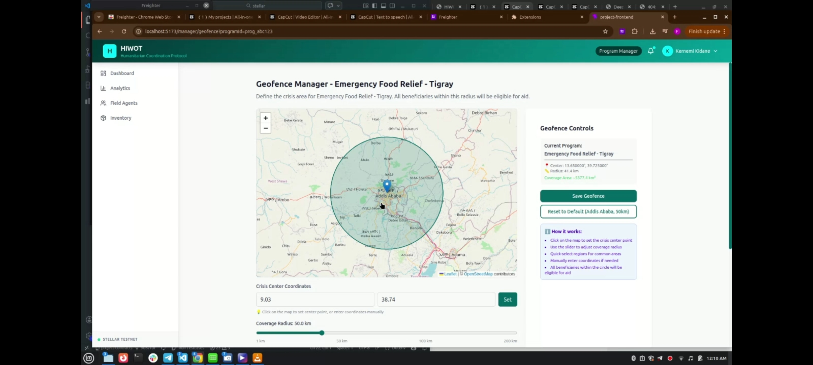
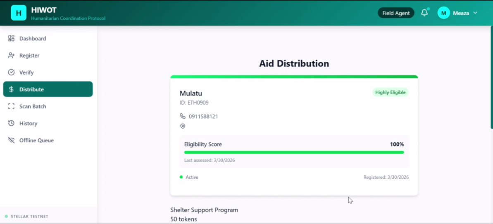
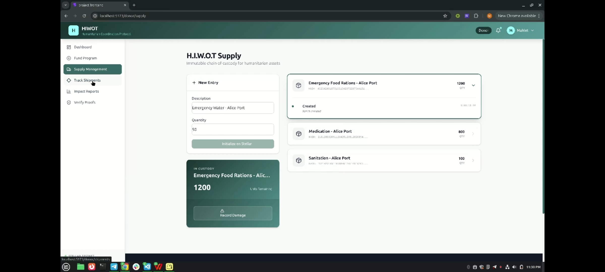
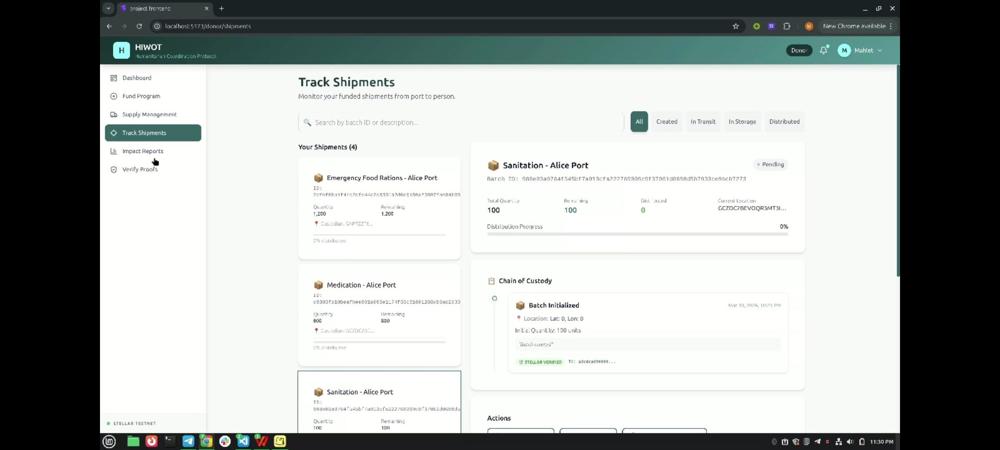
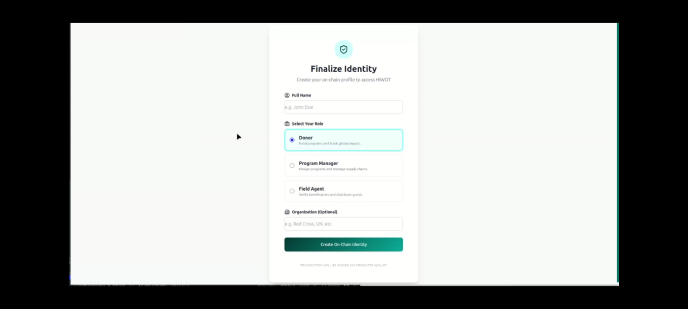

# Hiwot — Humanitarian Aid Distribution Platform

A blockchain-powered platform for coordinating cash and goods-based humanitarian aid distribution, designed for field operations in Ethiopia with offline-first capabilities.

## Project Overview

Hiwot connects donors, program managers, and field agents to deliver aid to beneficiaries transparently and efficiently. The platform uses Stellar Soroban smart contracts to ensure every distribution is recorded immutably, while an offline queue allows field agents to operate in areas with limited connectivity.

### Key Features

- **Cash & Goods Aid Programs** — Create and manage programs with geofenced distribution zones
- **Blockchain-Verified Claims** — Every distribution recorded on Stellar Soroban for transparency
- **Offline-First Field Operations** — Queue-based sync for remote areas with poor connectivity
- **Role-Based Access** — Manager, Donor, and Field Agent dashboards with appropriate permissions
- **Geofence Verification** — Ensure aid is distributed within designated program areas
- **Supply Chain Tracking** — End-to-end batch custody tracking for physical goods
- **Mock Bank Integration** — Simulated ETB (Ethiopian Birr) conversion with configurable exchange rate

## Tech Stack

| Layer | Technology |
|---|---|
| Runtime | Node.js (ES Modules) |
| API Framework | Express 5.x |
| Database | MongoDB 7.x + Mongoose 9.x |
| Blockchain | Stellar Soroban (Rust smart contracts, soroban-sdk 25.1.0) |
| Authentication | bcryptjs + API Keys (32-byte hex) |
| Smart Contracts | Identity, Disbursement, Token, Supply Chain |

## Impact

Hiwot addresses critical challenges in humanitarian aid distribution:

- **Transparency** — Every aid distribution is recorded on the Stellar blockchain, creating an immutable audit trail that donors and regulators can verify independently
- **Efficiency** — Field agents can register beneficiaries and distribute aid in real-time, with offline queuing ensuring no disruption in remote areas
- **Targeted Distribution** — Geofenced programs ensure aid reaches designated communities, reducing leakage
- **Privacy** — Cryptographic nullifiers and commitment schemes protect beneficiary identities while preventing duplicate claims
- **Local Context** — Ethiopian Birr (ETB) support via mock bank integration, designed for deployment in Ethiopia

## Screenshots

---

*Built for the Stellar Soroban ecosystem*
